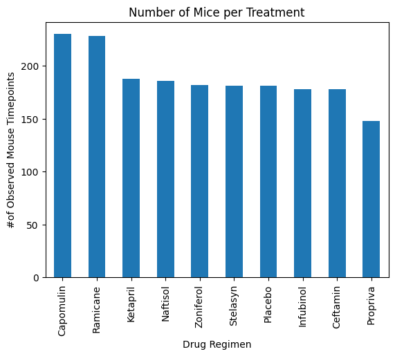

# Assignment5 Pymaceuticals Inc.
W5 Assignment matplotlib/numpy/scipy.stats

In this study, 249 mice identified with SCC tumor growth were treated with a variety of drug regimens. Over the course of 45 days, tumor development was observed and measured. The purpose of this study was to compare the performance of Pymaceuticals' drug of interest, Capomulin, versus the other treatment regimens.

